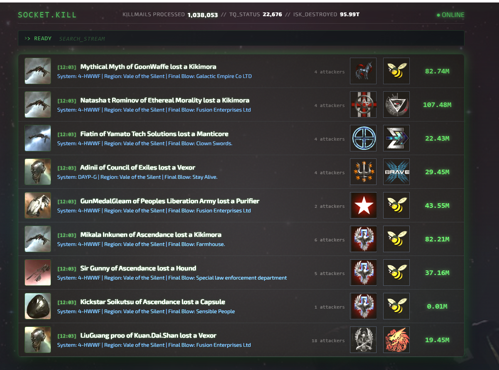

# Socket.Kill

The inspiration came from a development project where I was discarding some killmail data, and I decided to do something with that. Subsequently I decided fusing together kill mails with a level of atmosphere and depth that the community didn't ask for.

The scope is very simple, stream kills as fast as technically possible utilizing cloudflare page functions and edge caching, 

Nominated for [CCP Fanfest 2026 New Developer of the Year](https://www.eveonline.com/news/view/meet-your-eve-creator-awards-finalists).

**Live at [socketkill.com](https://socketkill.com) · [Discord](https://discord.gg/UnFN8UY6Dz)**



## Features

- **Real-time WebSocket feed.** Sub-second from kill to client. Most killboards poll; Socket.Kill pushes.
- **Per-kill social previews.** OG tags rendered server-side via Cloudflare Pages Functions, so Discord, Twitter, and Bluesky cards reflect actual kill data.
- **Edge-cached image proxy.** Ship renders, corp logos, alliance logos served via Cloudflare's edge. Performance improvement from the CCP image server.
- **Multi-channel Discord integration.** [Whale alerts, AT/officer/Rorqual sightings, Multiple Value Thresholds](https://discord.gg/UnFN8UY6Dz)
- **Multi-mode filtering** on the live feed, you can filter corporations, alliances, systems and region
- **Atmospheric interface.** Terminal-aesthetic design from the alien franchise 

## Architecture

```
zKillboard R2 Feed → R2 Background Worker → Processor → WebSocket Broadcast
                                                      → Discord Webhooks
                                                      → Stats Manager
                                                      → R2 State Persistence
```

## Tech stack

- **Runtime:** Node.js
- **Transport:** Socket.io (WebSocket + polling fallback)
- **Backend:** DigitalOcean ARM VM
- **Frontend:** Cloudflare Pages + Pages Functions
- **Storage:** Cloudflare R2
- **Image delivery:** Cloudflare edge
- **EVE data:** ESI (EVE Swagger Interface) for character, corporation, and universe data

## API

A public image proxy API is available for EVE Online assets. Free to use for personal and third-party projects. If you integrate this API into your tool or application, a credit link back to [socketkill.com](https://socketkill.com) is appreciated.

Full API documentation: [api.socketkill.com/docs](https://api.socketkill.com/docs/)

## WebSocket access

A real-time killmail stream is available via WebSocket for approved integrations. Access is whitelist-based. If you would like to connect your application to the live feed, get in touch to discuss your use case.

## Legal

EVE Online and the EVE logo are registered trademarks of CCP hf. All rights are reserved worldwide.

All other trademarks are the property of their respective owners. EVE Online, the EVE logo, EVE, and all associated logos and designs are the intellectual property of CCP hf. All artwork, screenshots, characters, vehicles, storylines, world facts, or other recognizable features of the intellectual property relating to these trademarks are likewise the intellectual property of CCP hf.

CCP hf. has granted permission to socketkill.com to use EVE Online and all associated logos and designs for promotional and informational purposes on its website but does not endorse, and is not in any way affiliated with, socketkill.com.

CCP is in no way responsible for the content on or functioning of this website, nor can it be liable for any damage arising from the use of this website.

## Credits

Developed by [@ScottishDex / Dexomus Viliana](https://socketkill.com)

Killmail data: [zKillboard](https://zkillboard.com)

[EVE API Explorer](https://developers.eveonline.com/api-explorer)